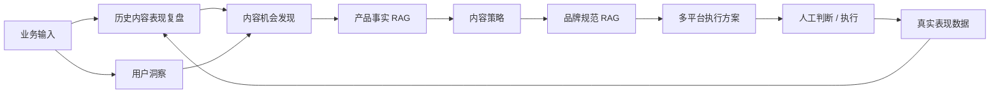

# AI Content Growth Copilot

> **AI 能生成内容，但真正难的是判断：下一步什么最值得做，以及为什么。**

AI Content Growth Copilot 是一个面向内容运营 / 新媒体运营 / 小型内容团队的 **AI 内容增长决策 Workflow（工作流）**。  
它不以“批量生成文案”为核心，而是把 **历史表现、用户反馈、产品事实、品牌规范** 串进同一条决策链路，帮助运营人员从证据出发发现内容机会、制定策略，并为下一轮增长实验提供依据。

**Status:** V1.2 · Dify Workflow · RAG · Eval · Human-in-the-loop · Web Demo

**Live Demo:** https://ai-content-growth-copilot.vercel.app/

---

## 1. 它解决什么问题

通用大模型已经很擅长写标题、文案和选题，但内容运营真正困难的往往不是“怎么写”，而是：

- 用户现在真正关心什么？
- 哪个内容方向最值得优先做？
- 这个判断基于什么证据？
- 产品是否真的能承接这个需求？
- 不同平台应该如何执行，而不是简单改写？
- 上一轮真实表现，如何进入下一轮决策？

因此这个项目把重点放在 **Decision Support（决策支持）**，而不是单纯的 Content Generation（内容生成）。

| 通用对话式生成 | AI Content Growth Copilot |
| --- | --- |
| 一次性 Prompt 生成 | 固定业务 Workflow |
| 容易从产品卖点反推用户需求 | 用户证据优先 |
| 历史表现常停留在复盘 | 历史结果进入下一轮决策 |
| 容易输出很多相似建议 | 动态输出 1–3 个高价值机会 |
| 平台适配常变成简单改写 | 分平台设计表达与执行逻辑 |
| 修改后难判断是否退化 | 固定 Eval Cases 做回归 |

---

## 2. 核心 Workflow



### 输入
- 产品介绍
- 目标用户
- 核心卖点
- 用户反馈
- 运营目标
- 目标平台
- 历史内容数据（可选）
- 账号基线指标（可选）

### 输出
不是直接产出一堆完整文案，而是优先输出：
1. 用户洞察
2. 1–3 个内容机会
3. 每个机会的证据与判断依据
4. 内容策略
5. 多平台执行方案
6. 风险 / 数据缺口 / 待验证假设

---

## 3. 为什么用 Workflow，而不是把全部流程做成 Agent

这个业务链路的主流程相对稳定：  
**用户洞察 → 内容机会 → 策略 → 多平台执行**

因此 V1 优先选择 Workflow：

- **可控**：每个节点职责清晰
- **可观测**：能定位问题出在哪个节点
- **可测试**：可以对单节点和整条链路做 Eval
- **可回归**：修改 Prompt / 模型 /规则后，可重新跑固定测试集

对于未来的开放任务，例如竞品搜索、热点研究、外部信息检索，可以在局部引入 Agent，而不是为了“Agent 化”让整条链路失去可控性。

---

## 4. 关键产品机制

### Evidence-first
用户需求优先来自真实反馈。  
系统明确区分：

- Fact（事实）
- Inference（推断）
- Hypothesis（假设）

证据不足时允许明确说“不足”，而不是补全一个看似完整的结论。

### Dynamic Opportunity Count
V1.1 不再强制输出固定数量的内容机会。  
当有效证据只有 1–2 个方向时，只输出 1–2 个，避免为了凑数量制造重复需求。

### RAG Knowledge Layer
RAG（检索增强生成）用于约束两类信息：

- **产品事实与能力边界**
- **品牌 / 内容表达规范**

目的是降低“模型根据行业常识自行补产品能力”和品牌表达越界。

### Growth Loop（增长闭环）
历史内容表现不是报表终点，而是下一轮决策输入：

**内容机会 → 策略 → 执行 → 真实表现 → 复盘 → 下一轮机会**

---

## 5. Eval（评测）

项目使用固定评测集而不是随机试 Prompt。

公开版 Rubric 包含四个维度：

| 维度 | 权重 |
| --- | ---: |
| 事实与证据边界 | 35 |
| 平台适配 | 25 |
| 品牌一致性与风险 | 20 |
| 策略差异性与可执行性 | 20 |

并设置 Hard Fail（硬失败）规则，例如：

- 编造产品能力、数据、价格或案例
- 把 AI 推断写成用户明确需求
- 无证据做确定性预测
- 明显违反输入中的品牌 / 风险约束
- 内容机会高度重复、靠换说法凑数量
- 上游已标记“待确认”的信息在下游被升级成事实

详见：
- [Eval Rubric](eval/rubric.md)
- [Public Eval Cases](eval/eval-cases.csv)

---

## 6. V1 → V1.1：一次真实的产品迭代

V1 的关键问题不是“生成质量不够华丽”，而是：

> **为了输出固定数量的策略，模型会重复或扩展用户没有表达的需求。**

V1.1 的核心改动：

- 内容机会由固定数量改为 **1–3 条动态输出**
- 按底层用户任务 / JTBD 去重
- 每个机会必须有独立的信息增量
- 用户需求证据与历史表现证据分开处理
- 证据不足时降低优先级或不输出

这次迭代的目标不是“让模型写得更多”，而是 **减少无效建议，提高决策密度**。

详见 [Iteration Log](docs/iteration-log.md)。

### V1.2：性能与成本优化

在同一固定测试 Case 下，对多节点 Workflow 做了 Prompt 去重、上游输出压缩和并行化调整：

| 版本 | 运行耗时 | Total Tokens |
| --- | ---: | ---: |
| V1.1 Baseline | 87.767s | 35,519 |
| V1.2 Final | 37.288s | 16,469 |

相较 Baseline，运行耗时下降约 **57.5%**，Token 消耗下降约 **53.6%**。  
这次优化的目标不是减少业务约束，而是在保留证据边界、动态机会数量和风险控制的前提下，降低多节点上下文累积造成的延迟与成本。

---

## 7. Repository Structure

```text
.
├── README.md
├── LICENSE
├── dify/
│   ├── AI_Content_Growth_Copilot_V1.1.yml
│   └── AI_Content_Growth_Copilot_V1.2.yml
├── docs/
│   ├── product-design.md
│   └── iteration-log.md
├── eval/
│   ├── rubric.md
│   └── eval-cases.csv
├── samples/
│   ├── sample-input.md
│   └── sample-output-template.md
└── web/
    ├── app/
    ├── components/
    └── lib/
```

---

## 8. Quick Start

1. 在 Dify 中新建 / 导入 Workflow。
2. 推荐导入最新版本 `dify/AI_Content_Growth_Copilot_V1.2.yml`。
3. 重新绑定你自己的 LLM Provider。
4. 为两个知识检索节点分别绑定：
   - 产品事实 / 能力边界知识库
   - 品牌 / 内容表达规范知识库
5. 使用 `samples/sample-input.md` 进行测试。
6. 用 `eval/eval-cases.csv` 做基础回归验证。

> **注意：** 公开仓库不包含私有知识库内容、API Key、Token 或真实业务敏感数据。导入后需要重新配置模型与知识库。

---

## 9. Current Limitations

- 当前版本以固定业务 Workflow 为主，尚未把开放式外部搜索做成 Agent。
- 公共仓库不包含实际业务知识库内容。
- Eval 目前重点验证内容决策质量与风险，不等同于真实线上业务效果。
- 商业化和真实用户付费仍属于后续验证阶段。

---

## 10. Product Principle

> **AI 架构本身没有价值，只有当它能让决策更有依据、更稳定、更可验证时，才有产品价值。**

---

## License

MIT License.
